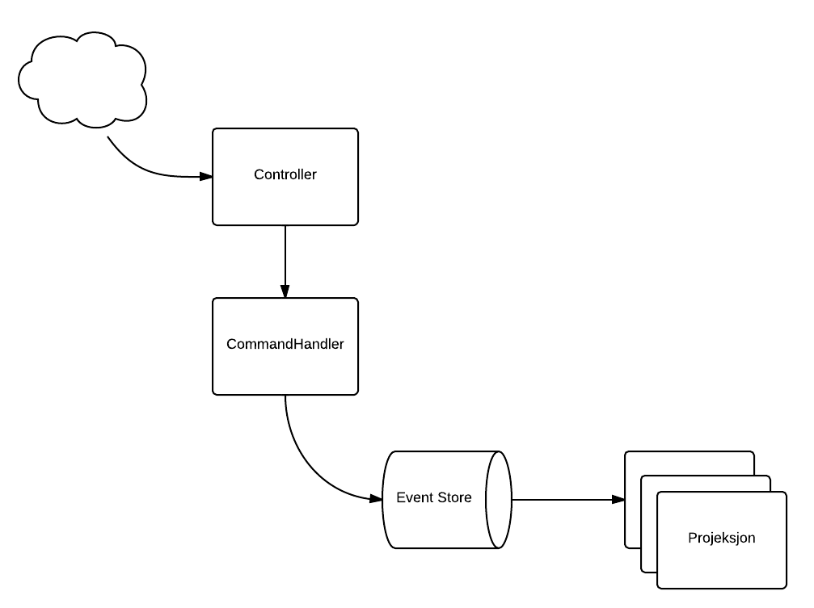

================

Need monsters to populate the dungeons of your secret lair? The Monster Shop provides the internets best selection of foul beasts and terrifying horrors, all accessible through a user friendly webpage.

##Your mission (should you choose to accept it)

You've been brought in as a consultant to complete the work on the Monster Shop after the previous developer had an unfortunate accident involving one of the shops products.

The late developer completed the client side, and had just started the rest API's before becoming monster food - so we have a working front end, but the back end consists of the login handling and a few API stubs.

After giving his bloody notes a quick clean you gather the information below:

---------------------------------------

### The domain

The context of our domain is the Monster Shop, and it's mechanisms for shopping and placing orders.

* _Monster type_: A species of monster avaliable for sale in the monster shop
* _Monster_: A "monster instance": the physical monster transported to the customer upon a confirmed order.
* _Basket_: The temporary shopping basket a customer uses to create his order. A item in the basket is transformed to a item in an order upon confirmation.
* _Basket line item_: A item in the basket, consisting of a specified monster type, a price, and an amount of monsters of that type.
* _Order confirmation_: A confirmation issued by the customer transforming the basket to an order.
* _Order_: A confirmed order consisting of one or more order line items.
* _Order line item_: A confirmed order for a specified number of monsters at a specified price.
* _Customer_: A evil overlord shopping and placing orders at the monster shop.

### Plans for the server side

The server side implementation has been started, but not completed. Login and retrial of the product catalogue has been taken care of, but the api for doing the actual shopping consists of stubs with no implementation. There is no write or read layer either.

The plan is to implement the write layer as an event store, and the read layer as projections of the events in this store, as shown in the illustration below.

Note that there are multiple patterns for event sourcing, the above being one of the more common. So while you're free to choose your own implementation, the below could function as a guide.

* The _event store_ need to be able to receive events and store them to a journal. In a first implementation the journal might simply be an array in the event store class.
* A _projection_ should be able to receive events and change state according to the nature of the event. This state could be kept in a suitable collection within the class.
* The event store should, after a event is received and stored, publish the event to _subscribing_ projections. 
* The _aggregate_ (with command handler) should be able to receive and validate commands, dispatching derived events to the aggregates event store.
* The REST controller should be able to _dispatch commands_ to the command handler.
* The REST controller should _query_ the projections to retrieve system state when needed.
* Finally, remove the serverMock.js include from the index.html file - this will switch off mocking and the client will make its requests directly to the server.

### Components of an Event Sourced System

#### The Event Store
* The event store receives, stores, and publishes incoming events
* Events are _immutable_ objects
* The event log is _append-only_
* All events are read on startup
* Reading of the log is always done from the oldest to the newest event (no random access)

#### Projections
* Projections form the read layer of the application
* Subscribes to events from a store
* Alter state based on received events

#### Command Handlers/aggregate
* Forms, with the event store, the write layer of the application
* Receives and validates incomming commands. Some commands require access to aggregate state for validation, these use aggregate state generated by retrieving and handling events from the event store by aggregate id.
* Performes operations required to complete the command, and dispatches derived events to the event store

### Resources

* monstershopen java: https://github.com/andreasBerre/monstershopen
* monstershopen c#: https://github.com/oven/monstershopen.net
* slides from presentation: http://goo.gl/G1U9HS  
